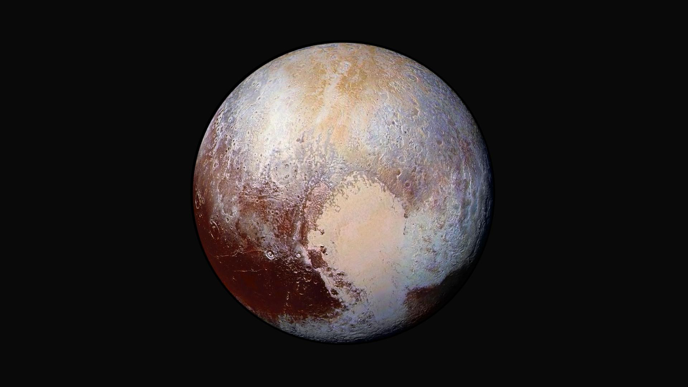

# Titolo del capitolo

## Titolo della sezione

Testo della sezione.

Tabella di esempio.

```{=latex}
\begin{table}[H]
	\centering
	\begin{tabularx}{\textwidth}{|X|X|}
        \hline
		Colonna uno & Colonna due \\ \hline
        Cella uno & Cella due \\ \hline
	\end{tabularx}
\end{table}
```

Sezione di codice di esempio.

    object Main extends App {

        println("Helloworld!")

    }

Citazione di esempio.

> "Kelsey, in this terrifying world, all we have are the connections that we make." - Bojack Horseman, "Fish out of water", 04x03

Immagine di esempio in figura \ref{image}.

{ width=100% }
